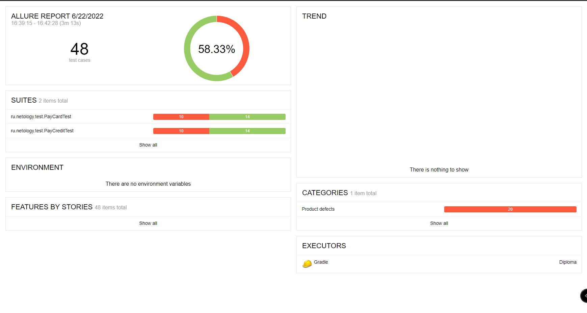

# Отчет по итогам тестирования

### Краткое описание

Проведено автоматизированное тестирование сервиса по покупке тура.

### Количество тест-кейсов

Общее количество тест-кейсов для каждой СУБД - 48.

### Результаты тестирования

Отчет о тестировании был сформирован "Allure":
1. Количество тест-кейсов = 48.
2. Количество позитивных тест-кейсов = 28.
3. Количество негативных тест-кейсов = 20.

Скриншот "Allure":

На дефекты заведены Issues.

### Общие рекомендации

Необходимо исправить найденные дефекты.